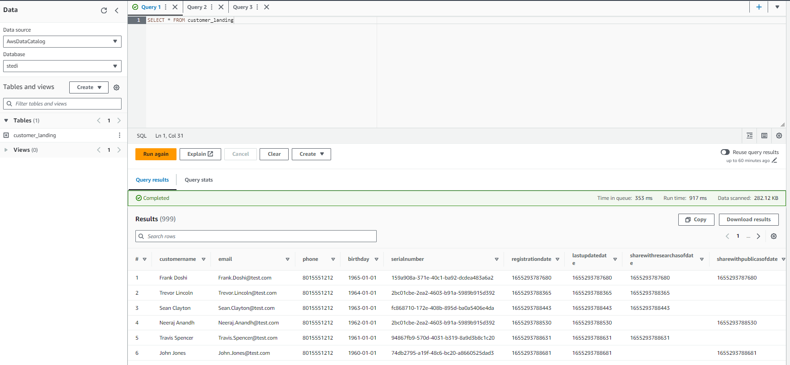
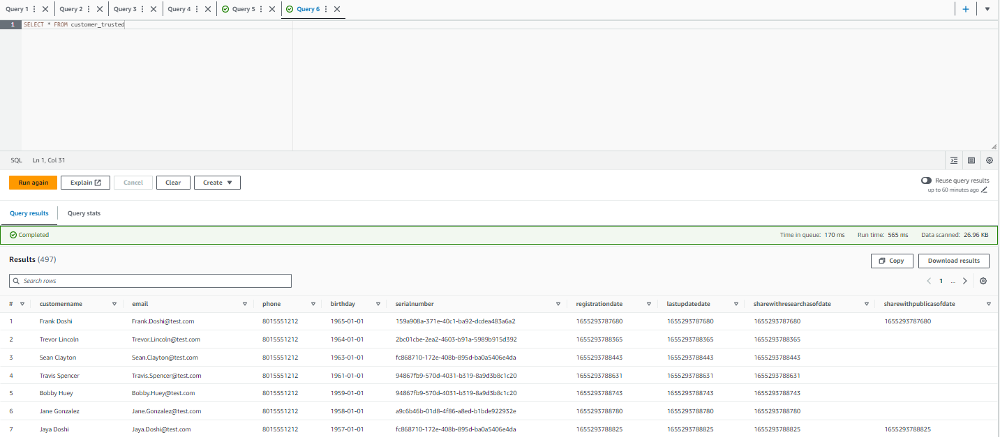

# STEDI Human Balance Analytics

In this project, i will build a data lakehouse solution for sensor data that trains a machine learning model for for the STEDI team.

I will extract the data produced by the STEDI Step Trainer sensors and the mobile app, and curate them into a data lakehouse solution on AWS so that Data Scientists can train the learning model.

## Project Details
STEDI has heard from millions of early adopters who are willing to purchase the STEDI Step Trainers and use them.

Several customers have already received their Step Trainers, installed the mobile application, and begun using them together to test their balance. The Step Trainer is just a motion sensor that records the distance of the object detected. The app uses a mobile phone accelerometer to detect motion in the X, Y, and Z directions.

The STEDI team wants to use the motion sensor data to train a machine learning model to detect steps accurately in real-time. Privacy will be a primary consideration in deciding what data can be used.

Some of the early adopters have agreed to share their data for research purposes. **Only these customers’ Step Trainer and accelerometer data should be used in the training data for the machine learning model.**

## Project Environment
#### AWS Environment

I'll use the data from the STEDI Step Trainer and mobile app to develop a lakehouse solution in the cloud that curates the data for the machine learning model using:

- Python and Spark
- AWS Glue
- AWS Athena
- AWS S3

#### Github Environment
I'll also need a github repository to store SQL scripts and Python code in.

#### Workflow Environment Configuration
Create Python scripts using AWS Glue and Glue Studio. These web-based tools and services contain multiple options for editors to write or generate Python code that uses PySpark. Remember to save any code you develop or run in these editors on AWS to a local Github Repository.
## Project Data
STEDI has [three JSON data sources](https://github.com/udacity/nd027-Data-Engineering-Data-Lakes-AWS-Exercises/tree/main/project/starter "Project's Data") to use from the Step Trainer. Check out the JSON data in the following folders in the Github repo linked above:
- customer
- step_trainer
- accelerometer
**1. Customer Records (from fulfillment and the STEDI website):**
contains the following fields:
- Serialnumber, sharewithpublicasofdate, birthday, registrationdate, sharewithresearchasofdate, customername, email, lastupdatedate, phone, sharewithfriendsasofdate

**2. Step Trainer Records (data from the motion sensor):**
contains the following fields:
- sensorReadingTime, serialNumber, distanceFromObject

**3. Accelerometer Records (from the mobile app):**
contains the following fields:
- timeStamp, user, x, y, z

**My Note:** create S3 directories for customer_Landing , step_trainer_Landing , and Accelerometer_Landing  zones, and copy the data there as a starting point.

To copy the data clone this [repo](https://github.com/udacity/nd027-Data-Engineering-Data-Lakes-AWS-Exercises/ "Project's Data"), the data we’re going to use resides in the project starter directory.

## Querying Data Using AWS Athena
**querying customer_landing glue table**

**Result:** raw data from the data source loaded to the landing zone without any manipulation to be available for processing.

**querying customer_trusted glue table**

**Result:** the customers who agreed to share their data for research purposes.

filtering out records that did not meet privacy requirements based on shareWithResearchAsOfDate field, that should not have a zero value

**My Note:** The customers who have agreed to share their data, don’t have blank rows in the shareWithResearchAsOfDate field.

## Files In The Repository
**Python files generated by AWS Glue Studio - Glue Jobs** 

- **customer_landing_to_trusted.py** A Python script using Spark that sanitizes the Customer data from the Website (Landing Zone) and only store the Customer Records who agreed to share their data for research purposes (Trusted Zone). 
- **accelerometer_landing_to_trusted.py** A Python script using Spark that sanitizes the Accelerometer data from the Mobile App (Landing Zone) - and only store Accelerometer Readings from customers who agreed to share their data for research purposes (Trusted Zone).
- **customer_trusted_to_curated.py** A Python script using Spark that sanitizes the Customer data (Trusted Zone) and create a Glue Table (Curated Zone) that only includes customers who have accelerometer data and have agreed to share their data for research.
- **step_trainer_landing_to_trusted.py** A Python script using Spark that read the Step Trainer IoT data stream (S3) and populate a Trusted Zone Glue Table called step_trainer_trusted that contains the Step Trainer Records data for customers who have accelerometer data and have agreed to share their data for research.
- **machine_learning_curated.py** A Python script using Spark that creates an aggregated table that has each of the Step Trainer Readings, and the associated accelerometer reading data for the same timestamp, but only for customers who have agreed to share their data.

**SQL (DDL) files - Glue table**
- **customer_landing.sql** SQL queries for creating a Glue table for (S3) customer landing zone.
- **accelerometer_landing.sql** SQL queries for creating a Glue table for (S3) accelerometer landing zone.

**Query Screenshots - AWS Athena**
- **customer_landing.png** A screenshot of Athena query customer_landing table.
- **customer_trusted.png** A screenshot of Athena query customer_trusted table. The output only contains Customer Records from people who agreed to share their data.
- **accelerometer_landing.png** A screenshot of Athena query accelerometer_landing table.

